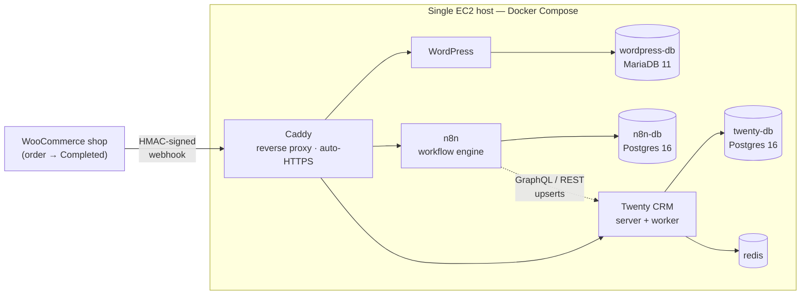
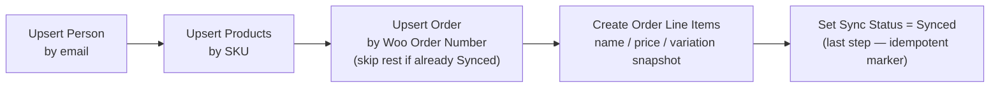

# WooCommerce → Twenty CRM Integration — Engineering Summary

*Snapshot: 2026-07-20. Weighted completion: **62.4%**. Categories 5–7 (sync chain,
Twenty automations, demonstration) are actively in progress — this document
will be refreshed once they're complete. See `PROGRESS.md` for the live status
board and `README.md` for full setup/architecture detail.*

A self-hosted pipeline that syncs completed WooCommerce orders — customers,
products, quantities, prices, variations, and add-ons — into Twenty CRM, with
dedup-safe upserts and retry handling designed to survive duplicate webhook
deliveries and partial failures.

---

## 1. Architecture

One EC2 host, one Docker Compose stack, one public entry point.

Every service runs as a Docker Compose container on a single Ubuntu 24.04 EC2
instance (t3.medium, eu-central-1) behind a fixed Elastic IP. **Caddy is the
only container with a published host port** — it terminates HTTPS
automatically (Let's Encrypt) and reverse-proxies to the shop, the workflow
engine, and the CRM by hostname. Every database sits on the internal Docker
network only, never reachable from the internet.

No purchased domain is required: `n8n.<elastic-ip>.sslip.io`,
`crm.<elastic-ip>.sslip.io`, and `shop.<elastic-ip>.sslip.io` resolve straight
back to the box via sslip.io's wildcard DNS, which is enough for Caddy to
obtain real certificates. SSH is restricted to the owner's own IPv4 `/32`;
only 80 and 443 are otherwise open. All persistent state lives in named
Docker volumes, so a container restart or redeploy doesn't lose data.

The compose files are deliberately split in two: `docker-compose.yml` is the
core integration stack (Caddy, n8n + n8n-db, Twenty server + worker +
twenty-db + redis); `docker-compose.override.yml` layers on the WordPress
test shop, kept separate because a real deployment would point at an
already-hosted WooCommerce store instead of standing up its own.

---

## 2. CRM data model

Four objects in Twenty, each with a natural, stable identifier — chosen so
upserts are safe to run any number of times.

| Object | Unique key | Fields | Relations |
|---|---|---|---|
| **Person** *(built-in)* | Email, lowercased | Name, email | ← Order.Customer |
| **Product** | `SKU` | SKU, Current Price, Description | ← Order Line Item.Product |
| **Order** | `Woo Order Number` | Total, Order Date, Sync Status (`STATUS_PENDING`/`STATUS_SYNCED`) | Customer → Person; ← Order Line Item.Order |
| **Order Line Item** | Order + Product + Variation | Quantity, Unit Price, Line Total, Variation, Name *(snapshot)* | Order →, Product → |

**Why these keys:**
- **Email, lowercased,** is the one identifier guaranteed present whether the
  customer registered an account or checked out as a guest — a returning
  guest and a returning registered customer both resolve to the same Person.
- **SKU** is the business identifier Spines already assigns, specific enough
  to distinguish variations directly (`PKG-ESS` vs. `PKG-SIG` vs. `PKG-PAR`)
  without extra modeling.
- **Order Line Item's Name field is a point-in-time snapshot** of the product
  name as sold, written at sync time — not a live lookup through the Product
  relation. A later rename or price change on the Product must never rewrite
  what a past order shows the customer actually bought and paid.

**Naming detail worth knowing:** Twenty validates SELECT field option values
against a two-segment pattern (`^[A-Z0-9]+_[A-Z0-9]+$`) — a bare `PENDING` is
rejected. Sync Status therefore stores `STATUS_PENDING`/`STATUS_SYNCED` under
the hood, while the human-facing labels stay "Pending"/"Synced." Anything
writing to this field has to use the real enum literal, not the label.

---

## 3. Sync & automation

The webhook gate is built and verified against live traffic. The upsert
chain and both Twenty-side automations are specified in full and in active
build.

### Webhook gate — built, verified against live WooCommerce traffic

1. **Webhook node** receives the WooCommerce `order.updated` delivery with
   raw-body capture enabled.
2. **Verify Signature** (Code node) computes HMAC-SHA256 over the raw body
   with the shared webhook secret and compares it to the
   `x-wc-webhook-signature` header using a timing-safe comparison.
   WooCommerce's own connectivity ping (`webhook_id=…`, no real signature) is
   recognized and short-circuited to a clean success without reaching
   further logic.
3. **"Only Completed" gate** (IF node) checks `status == "completed"`. Any
   other status exits with zero writes to Twenty.

This gate has been exercised against real WooCommerce deliveries, not
synthetic payloads: real orders were flipped through non-completed and
completed statuses and traced end-to-end in n8n's own execution log, and a
deliberately forged signature was sent directly at the endpoint to confirm it
is actually rejected rather than passed through.

### Upsert chain into Twenty — designed, build in progress

Every step is a lookup-by-natural-key, create-only-if-missing operation —
never an unconditional insert. The Sync Status flip happens last and only
after every line item exists, which is what makes it both a safe resume
marker for retries and a clean trigger for the completed-order email
automation.

### Twenty automation — ARR on Opportunity

A Code step recomputes `ARR = Amount × 12` whenever an Opportunity's Amount
is created or changed, safely coercing empty/zero amounts to `0` rather than
erroring. The automation's trigger is restricted to fire only on changes to
the **Amount** field; the subsequent Update Record step only ever writes the
**ARR** field. Because that write's changed-field set never includes Amount,
it can never re-match the trigger — the loop-guard is structural, not a flag
or counter. This piece is built and verified: the field exists, is
queryable, and the anti-loop mechanism was confirmed against Twenty's own
equivalent seeded workflow logic.

### Twenty automation — completed-order email

Triggers on Order.Sync Status transitioning to Synced (restricted to that
one field, so it fires exactly once per order's real lifetime), pulls the
order's Line Items, and a Code step formats an HTML summary — customer, order
date, a product/variation/qty/price table, and the order total — for a Send
Email step to a configurable recipient. Fully specified against the real,
verified field and relation names; not yet clicked into existence in
Twenty's UI (see Limitations).

---

## 4. Dedup & retry approach

One rule covers every required scenario: upsert by natural key, never by
"have we seen this webhook before."

Deliveries aren't deduplicated by tracking webhook or delivery IDs — that
approach breaks the moment a retry arrives under a different delivery ID for
the same logical order, or someone manually re-sends a webhook from the
WooCommerce admin. Instead, every write in the chain looks up a stable
business key first and only creates a record if nothing matches it.

| Scenario | Why it produces zero duplicates |
|---|---|
| Same webhook delivered twice | Re-running the chain against an already-synced order re-finds the same Person/Product/Order/Line Item rows; nothing new is written, and the Order's Sync Status = Synced check skips the remaining steps entirely. |
| Retry after a partial failure | Every step is independently idempotent. Re-running the same or a fresh delivery simply picks up wherever it stopped — already-created rows are found, not duplicated — and Sync Status staying Pending is itself the signal a retry is still owed. |
| Returning customer | Person upsert by lowercased email finds the existing record instead of creating a second one — true whether the customer is a guest or has an account. |
| Same product across multiple orders | Product upsert by SKU finds the existing Product; only a new Order Line Item pointing at it is created per order. |
| Multi-product orders, variations, add-ons | Every Woo line item — including variations and the paid add-on modeled as its own line item — becomes its own Order Line Item row against the same Order. |

Signature verification additionally ensures only genuine WooCommerce-
originated requests ever reach this chain, so dedup logic only ever has to
reason about legitimate retries, not forged traffic.

---

## 5. Engineering decisions & incidents

Three findings from the build, in the order they happened — kept here
because how each was caught matters as much as the fix.

**1 — A stale blocker on the status board.** The project's own tracking
board described the webhook secret and CRM API key as missing. Direct
inspection of the running containers showed both were already populated and
valid — a prior session had fixed it without updating the record. The
webhook's stored secret was re-synced belt-and-suspenders anyway, and the
board was corrected. *Takeaway: a status board is a claim, not a fact —
worth checking live system state before trusting it, including your own
project's.*

**2 — A silent 404 on every real webhook delivery.** Before:
`/webhook/WooCommerce-orders`. After: `/webhook/woocommerce-orders`. n8n's
webhook node was registered with a mixed-case path, while WooCommerce's
actual delivery URL — and the project's own documented path — used
lowercase. n8n webhook paths are case-sensitive, so **every real delivery
had been returning 404 before this fix**, regardless of whether the
signature-verification logic was correct. Found and fixed by exporting the
workflow, correcting the path, re-importing, and restarting to reload n8n's
webhook registry (plus removing a stale duplicate route left behind in its
database). Confirmed with direct requests: the corrected path now responds
200, the old path now correctly 404s. Verification didn't stop at the fix —
real orders were then flipped through real status transitions and traced
through n8n's own execution log to confirm the whole gate behaves correctly
against live traffic, not just a manual test payload.

**3 — A "100% built" CRM data model that wasn't there.** While starting the
Twenty automations, the Order/Product/Order Line Item objects — recorded as
fully built — turned out not to exist. Confirmed two independent ways:
Twenty's own metadata API listed only the built-in objects, and a direct
read of Twenty's Postgres metadata tables (bypassing any API-key scoping)
returned zero matching rows. GraphQL schema introspection confirmed it a
third time. The root cause (never created vs. later wiped) was left
undetermined rather than guessed at. With that confirmed and the owner's
sign-off to proceed, the entire data model — three objects, every field, all
three relations including both inverse sides — was rebuilt through Twenty's
own metadata API, working from the exact request shapes read out of the
running container's compiled source rather than assumed. It was then proven
with a live round trip: one real record created per object, relations
confirmed to resolve in both directions, a duplicate SKU and a duplicate
order number each attempted and correctly rejected by Twenty's own
uniqueness constraint — the exact guarantee the sync chain's dedup logic
depends on — and every test record then deleted and confirmed gone.

---

## 6. Limitations & open items

- **Paid add-ons are separate line items, not native Woo add-ons.**
  WooCommerce core has no built-in paid-add-on concept. Modeling the
  audiobook add-on as its own order line item is a deliberate simplification
  for this build, not an oversight.
- **No purchased domain.** Hostnames come from sslip.io wildcard DNS tied to
  the Elastic IP. If that IP ever changes, every domain and the WooCommerce
  webhook delivery URL need updating together.
- **Single host, no HA.** No failover for any component. Acceptable for a
  demo build; production would need managed/replicated databases and
  multiple app instances.
- **Twenty's workflow builder is UI-only for two step types.** Confirmed via
  full schema introspection: the Code step's function logic and the Send
  Email step's mailbox connection are backed by internal objects with no
  exposed API. Both Twenty automations need one human click-through session
  in Settings → Workflows — the exact field names and JS code are already
  written and verified against the real data model, so that session is
  mechanical, not exploratory.
- **No mailbox connected yet.** The completed-order email automation's Send
  Email step has nothing to send through — zero connected accounts exist in
  the workspace, and no mail environment variables are configured in the
  stack. Open item: a human still needs to connect an account (a Gmail
  app-password inbox, or a disposable SMTP catcher for demo purposes) before
  that step can actually deliver mail.
- **Order Line Item dedup rides on the parent Order's gate**, rather than a
  single composite uniqueness constraint on the line item itself (an order
  is only ever line-itemed once, since reruns against an already-synced
  order skip line-item creation). A modeling trade-off worth knowing, not a
  silent gap.
- **WordPress has no outbound mail transport.** Unrelated to the Twenty
  email automation above — WooCommerce's own admin notification emails fail
  silently for lack of a mail transport in the WordPress container. Harmless
  to the sync pipeline itself.

---

## 7. Current status

A weighted snapshot, not a final report — categories 5 through 7 are being
actively built as this document is generated.

| # | Category | Weight | Progress | Note |
|---|---|---|---|---|
| 1 | Infrastructure — server, compose, HTTPS | 20% | 100% | Verified live. |
| 2 | Shop + test data | 15% | 100% | Test orders staged and seedable. |
| 3 | Twenty data model + API access | 10% | 100% | Rebuilt after incident 3 above; verified via full round trip. |
| 4 | Webhook + security gate | 10% | 100% | Verified against live WooCommerce traffic. |
| 5 | Sync chain — upserts, dedup, retry | 20% | 5% | Designed; build in progress now. |
| 6 | Twenty automations — email + ARR | 10% | 20% | ARR field built & verified; both workflows fully specified, awaiting UI click-through. |
| 7 | Demonstration — 7 scenarios | 7% | 0% | Not started — depends on #5/#6. |
| 8 | Repo, README, deliverables | 8% | 55% | Scaffolding, env template, init scripts, README, AI-tools note done; workflow export & submission pending. |

**Weighted total: 62.4%.** This document will be refreshed once the sync
chain, both Twenty automations, and the seven demonstration scenarios are
complete.

---

*Prepared from the project's live status board and repository state,
2026-07-20. Full setup instructions, data-model rationale, and an AI-tools
disclosure note live in this repository's `README.md` and `AI_TOOLS.md`.*
